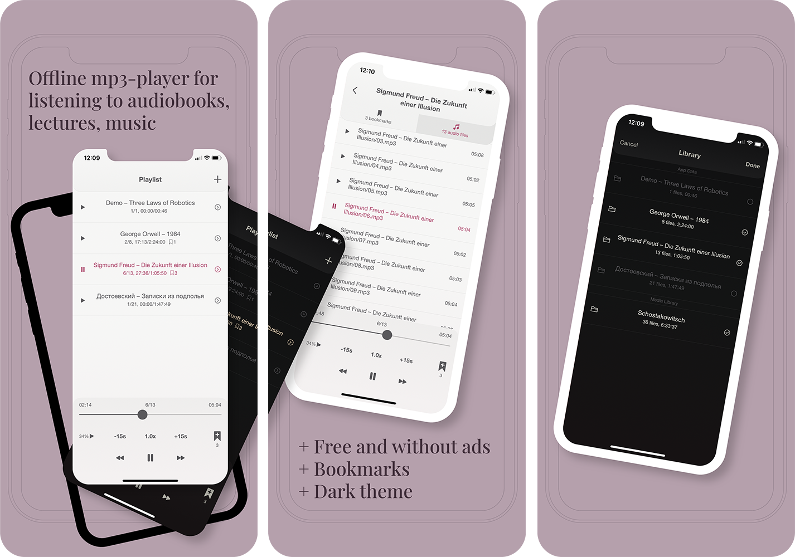

# MP3-BOOK
A simple player for listening to audiobooks, lectures, music in MP3 format. Enjoy it free on your iPhone and iPad!

    

## Features
* Import a folder of MP3 files or playlists using [Finder](https://support.apple.com/en-us/HT210598) on your Mac or [File Sharing](https://support.apple.com/en-us/HT201301) in iTunes
* Supporting only MP3 format
* Dark and Light themes
* Bookmarks with comments

## Privacy Policy
No Personal Data is collected. The App does not use third party services that may collect information used to identify User. Any information about the audiobooks imported by User stays confidential.

## License
GNU GPL v. 3.0
